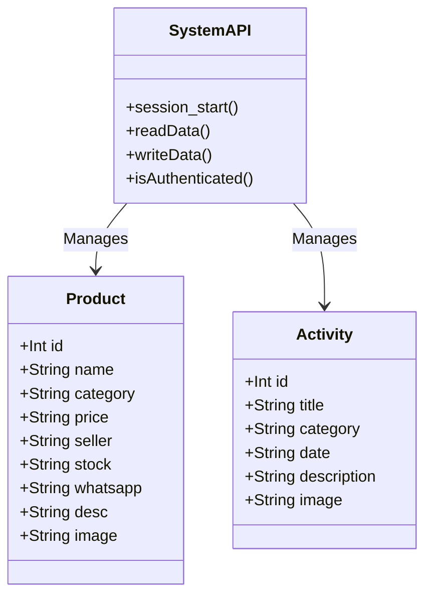

# Software Requirements Specification
## for <Web UMKM Desa Wisata Panggungharjo>

**Version 2.0 approved**

**Prepared by:**
- Zhara Ozawa (Author/Owner)

---

## Table of Contents
1. Pendahuluan
   1.1. Tujuan Penulisan Dokumen
   1.2. Audien yang Dituju dan Pembaca yang Disarankan
   1.3. Batasan Produk
   1.4. Definisi dan Istilah
   1.5. Referensi
2. Deskripsi Keseluruhan
   2.1. Deskripsi Produk
   2.2. Fungsi Produk
   2.3. Penggolongan Karakterik Pengguna
   2.4. Lingkungan Operasi
   2.5. Batasan Desain dan Implementasi
   2.6. Dokumentasi Pengguna
3. Kebutuhan Antarmuka Eksternal
   3.1. User Interfaces
   3.2. Hardware Interface
   3.3. Software Interface
   3.4. Communication Interface
4. Functional Requirement
   4.1. Use Case Diagram
   4.1.1. Use Case Melihat Katalog dan Detail Produk (FR-01, FR-02)
   4.1.2. Use Case Pengalihan ke WhatsApp (FR-03)
   4.1.3. Use Case Autentikasi Login Admin (FR-04)
   4.1.4. Use Case Mengelola Data Katalog Produk & Kegiatan (FR-05, FR-06)
   4.1.5. Class Diagram
5. Non Functional Requirements

---

## 1. Pendahuluan

### 1.1. Tujuan Penulisan Dokumen
Tujuan dari pengembangan website Web UMKM Desa Wisata Panggungharjo ini adalah untuk membangun sebuah platform informasi produk dan potensi desa yang transparan dan efisien. Sistem ini mampu menjembatani transaksi antara pembeli dan pengrajin UMKM secara langsung melalui integrasi WhatsApp tanpa memerlukan payment gateway yang rumit. Bagi pembeli, sistem ini bertujuan mempermudah pencarian produk khas desa melalui katalog digital yang mendetail. Sementara bagi pihak pengelola desa (admin), website ini mendigitalisasi pengelolaan data UMKM dan kegiatan desa melalui dashboard admin khusus yang mempermudah pembaruan data secara dinamis.

### 1.2. Audien yang Dituju dan Pembaca yang Disarankan
Dokumen Software Requirements Specification (SRS) ini ditujukan untuk beberapa pihak yang terlibat dalam perancangan, pengembangan, dan penggunaan sistem:
*   **Tim Pengembang (Developer):** Membaca dokumen ini sebagai panduan utama dalam mengimplementasikan logika sistem PHP, antarmuka pengguna HTML/CSS, dan integrasi WhatsApp.
*   **Manajer Proyek / Pengelola Desa:** Menggunakan dokumen ini untuk memonitor kesesuaian fitur aplikasi dengan visi promosi desa.
*   **Pemilik UMKM Lokal:** Sebagai stakeholder utama yang berkepentingan memastikan produk mereka dapat dikelola dan ditampilkan dengan baik.

### 1.3. Batasan Produk
Sistem yang dikembangkan adalah Website Katalog Penjualan dan Profil Desa Wisata berbasis *redirect* WhatsApp. Sistem ini bertindak sebagai penyedia informasi katalog dan penjembatan komunikasi. Sistem ini dibatasi dengan tidak memiliki fitur Payment Gateway terintegrasi maupun database relasional SQL (menggunakan JSON sebagai *flat-file database* untuk efisiensi *hosting* gratis). Seluruh proses penyelesaian transaksi pembayaran dilakukan sepenuhnya di luar sistem website melalui aplikasi WhatsApp.

### 1.4. Definisi dan Istilah
*   **SRS:** *Software Requirements Specification*, atau Spesifikasi Kebutuhan Perangkat Lunak.
*   **UMKM:** Usaha Mikro, Kecil, dan Menengah milik warga desa Panggungharjo.
*   **WhatsApp Redirect:** Sistem otomatisasi yang mengarahkan pengguna website secara langsung ke aplikasi WhatsApp penjual.
*   **Dashboard Admin:** Antarmuka khusus (*back-end*) yang hanya bisa diakses oleh pengelola untuk mengelola data produk dan kegiatan.
*   **CRUD:** *Create, Read, Update, Delete* – fungsi dasar manipulasi data.
*   **JSON:** *JavaScript Object Notation*, format penyimpanan data ringan yang digunakan menggantikan database SQL.

### 1.5. Referensi
*   Panduan Pembuatan SRS Standar IEEE.
*   UML Use Case & Activity Diagrams Guidelines.

---

## 2. Deskripsi Keseluruhan

### 2.1. Deskripsi Produk
Sistem ini merupakan perangkat lunak berbasis website katalog dan profil desa yang dirancang khusus untuk mendukung proses digitalisasi operasional UMKM Panggungharjo. Produk ini bertindak sebagai platform informasi digital interaktif di mana calon pembeli dapat menjelajahi seluruh daftar produk UMKM beserta spesifikasi lengkapnya. Sistem ini juga terintegrasi dengan peta interaktif (*Leaflet.js*) dan *timeline* kegiatan desa.

### 2.2. Fungsi Produk
Fungsi utama dari produk ini bagi **pengguna umum (pembeli/wisatawan)** adalah memfasilitasi pencarian unit produk UMKM secara mendetail dan mempermudah komunikasi pemesanan ke pihak penjual melalui tombol WhatsApp. Di sisi lain, fungsi produk bagi **pengguna admin** adalah menyediakan akses kontrol terpusat melalui halaman dashboard untuk menambah, mengubah, dan menghapus data produk UMKM serta jadwal kegiatan desa secara *real-time*.

### 2.3. Penggolongan Karakteristik Pengguna
| Kategori Pengguna | Tugas | Hak Akses | Kemampuan |
| :--- | :--- | :--- | :--- |
| **Pembeli / Wisatawan** | Melihat daftar produk, memfilter kategori, melihat peta desa, memantau kegiatan, dan inisiasi pemesanan via WhatsApp. | Akses Publik (Read-Only) | Mampu mengoperasikan peramban web dan aplikasi WhatsApp. |
| **Admin / Pengelola** | Mengelola manajemen katalog (tambah, edit, hapus produk & kegiatan). | Akses Penuh (CRUD / Back-end) | Memiliki ketelitian dalam memperbarui data melalui *dashboard*. |

### 2.4. Lingkungan Operasi
Sistem beroperasi di lingkungan berbasis web (*client-server*). Di sisi server, perangkat lunak berjalan di atas peladen web yang mendukung **PHP**. Data disimpan di dalam berkas teks **JSON** (`data.json`). Di sisi klien, pengguna mengakses aplikasi menggunakan peramban web populer (Chrome, Safari, Firefox) baik dari PC maupun *smartphone*.

### 2.5. Batasan Desain dan Implementasi
Sistem harus dibangun menggunakan antarmuka web responsif. Secara fungsionalitas, sistem dibatasi untuk tidak menggunakan *payment gateway*. Logika *backend* harus menggunakan arsitektur *file-based* (PHP membaca/menulis ke JSON) agar sistem dapat dengan sangat mudah di-*deploy* ke penyedia *hosting* gratis seperti InfinityFree tanpa hambatan pengaturan basis data.

### 2.6. Dokumentasi Pengguna
Pengembang menyediakan dokumen berupa *Walkthrough* dan *Task* list yang berisi prosedur penggunaan sistem, termasuk cara *login*, manipulasi data produk, serta instruksi *deployment* sederhana untuk pengelola.

---

## 3. Kebutuhan Antarmuka Eksternal

### 3.1. User Interfaces
1.  **Halaman Beranda & Katalog (`index.html`):** Berfungsi sebagai halaman awal. Menampilkan profil desa, peta, jadwal kegiatan, dan *grid* produk UMKM dengan fitur filter. Terdapat modal *pop-up* untuk detail produk.
2.  **Halaman Login (`admin.html`):** Halaman bagi pengelola untuk memasukkan kredensial keamanan sebelum mengakses *dashboard*.
3.  **Halaman Dashboard (`dashboard.html`):** Antarmuka panel admin berisi tabel data produk dan kegiatan, serta form interaktif untuk menambah atau mengedit data (CRUD).

### 3.2. Hardware Interface
Tidak ada integrasi perangkat keras khusus. Interaksi hanya bergantung pada layar monitor dan *smartphone* klien.

### 3.3. Software Interface
Berinteraksi langsung dengan *Application Programming Interface* (API) **WhatsApp** (melalui tautan URI `wa.me`) untuk pengalihan pesan. Membutuhkan interaksi dengan pustaka eksternal **Leaflet.js** untuk memuat ubin (*tiles*) peta dari OpenStreetMap.

### 3.4. Communication Interface
Sistem beroperasi menggunakan protokol standar HTTP/HTTPS. Pengambilan data dari antarmuka (*frontend*) menuju prosesor (*backend* PHP) dilakukan secara asinkron (*Fetch API*) dengan format pertukaran data JSON.

---

## 4. Functional Requirement

| ID | Kebutuhan Fungsional | Penjelasan |
| :--- | :--- | :--- |
| **FR-01** | Melihat Katalog Publik | Sistem menampilkan halaman utama berisi daftar produk UMKM, peta, dan kegiatan. |
| **FR-02** | Melihat Detail Produk | Sistem menampilkan modal *pop-up* saat produk diklik, berisi foto, harga, stok, dan spesifikasi lengkap. |
| **FR-03** | Pengalihan ke WhatsApp | Tombol pada detail produk mengarahkan pengguna ke aplikasi WhatsApp penjual. |
| **FR-04** | Login Admin | Sistem memverifikasi *username* dan *password* untuk membatasi akses dasbor pengelola. |
| **FR-05** | Mengelola Katalog Produk | Admin dapat melakukan Create, Read, Update, Delete (CRUD) data produk UMKM. |
| **FR-06** | Mengelola Timeline Kegiatan | Admin dapat melakukan Create, Read, Update, Delete (CRUD) data jadwal kegiatan desa. |

### 4.1. Use Case Diagram
Hubungan interaksi antara sistem dan aktor disajikan pada diagram berikut:

```mermaid
usecaseDiagram
    actor Pembeli
    actor Admin
    
    rectangle "Web UMKM Panggungharjo" {
        Pembeli --> (Melihat Profil Desa & Peta)
        Pembeli --> (Melihat Katalog Produk)
        Pembeli --> (Melihat Detail Produk)
        Pembeli --> (Dialihkan ke WhatsApp Penjual)
        
        (Melihat Detail Produk) .> (Dialihkan ke WhatsApp Penjual) : <<include>>
        
        Admin --> (Login)
        Admin --> (Akses Dashboard)
        Admin --> (Kelola Produk CRUD)
        Admin --> (Kelola Kegiatan CRUD)
        
        (Akses Dashboard) .> (Login) : <<include>>
        (Kelola Produk CRUD) .> (Akses Dashboard) : <<extend>>
        (Kelola Kegiatan CRUD) .> (Akses Dashboard) : <<extend>>
    }
```

### 4.1.1. Use Case Melihat Katalog dan Detail Produk (FR-01, FR-02)
**4.1.1.1. Deskripsi Use Case**
Proses bagi pembeli untuk mengakses halaman utama, melihat produk UMKM yang tersedia, dan menekan produk untuk melihat detail spesifikasinya.

**4.1.1.2. Stimulus dan Respon**
| Aksi dari Pembeli | Respon dari Sistem |
| :--- | :--- |
| Membuka halaman utama web | Mengambil data dari `api.php` dan merender kartu produk. |
| Mengklik kartu produk | Membuka *modal* overlay berisi informasi detail produk tersebut. |

**4.1.1.3. Activity Diagram**
```mermaid
flowchart TD
    |Pembeli| A[Membuka website] --> |Sistem| B[Meminta data via Fetch API]
    B --> C[Menampilkan Daftar Produk]
    |Pembeli| D[Mengklik produk] --> |Sistem| E[Menampilkan Detail Modal Pop-up]
```

### 4.1.2. Use Case Pengalihan ke WhatsApp (FR-03)
**4.1.2.1. Deskripsi Use Case**
Sistem mengalihkan pembeli yang menekan tombol "Hubungi Penjual" di halaman detail langsung ke aplikasi WhatsApp dengan URL yang sesuai.

**4.1.2.2. Stimulus dan Respon**
| Aksi dari Pembeli | Respon dari Sistem |
| :--- | :--- |
| Menekan tombol WhatsApp | Membuka tab/aplikasi baru mengarah ke URI `wa.me/nomor_penjual`. |

### 4.1.3. Use Case Autentikasi Login Admin (FR-04)
**4.1.3.1. Deskripsi Use Case**
Proses autentikasi yang membatasi hak akses agar hanya admin sah yang dapat masuk ke *dashboard*.

**4.1.3.2. Stimulus dan Respon**
| Aksi dari Admin | Respon dari Sistem |
| :--- | :--- |
| Memasukkan kredensial & klik Login | Memvalidasi data. Jika benar, membuat *session* dan mengarahkan ke `dashboard.html`. |

**4.1.3.3. Activity Diagram**
```mermaid
flowchart TD
    |Admin| A[Input Kredensial Login] --> |Sistem| B{Validasi Data?}
    B -- Tidak --> C[Tampilkan Pesan Error]
    B -- Ya --> D[Buat Session & Buka Dashboard]
```

### 4.1.4. Use Case Mengelola Data Katalog Produk & Kegiatan (FR-05, FR-06)
**4.1.4.1. Deskripsi Use Case**
Admin memanipulasi data produk atau kegiatan melalui antarmuka *dashboard* yang kemudian disimpan permanen ke dalam file `data.json`.

**4.1.4.2. Stimulus dan Respon**
| Aksi dari Admin | Respon dari Sistem |
| :--- | :--- |
| Mengisi form dan menekan 'Simpan' / 'Edit' / 'Hapus' | Mengirim permintaan POST/DELETE ke `api.php`. Menyimpan perubahan ke `data.json`. Menampilkan pesan sukses dan me-refresh tabel. |

**4.1.4.3. Activity Diagram**
```mermaid
flowchart TD
    |Admin| A[Klik Edit/Tambah/Hapus] --> |Sistem| B[Kirim Data ke API PHP]
    B --> C[Ubah file data.json]
    C --> D[Kirim respon Sukses]
    |Sistem| D --> E[Perbarui Tampilan Tabel Dashboard]
```

### 4.1.5. Class Diagram
Diagram arsitektur entitas data dalam file JSON:



---

## 5. Non Functional Requirements

| ID | Parameter | Kebutuhan |
| :--- | :--- | :--- |
| **NFR-01** | *Ergonomy (Responsiveness)* | Tata letak katalog harus menyesuaikan rapi saat diakses dari PC maupun *smartphone*. |
| **NFR-02** | *Portability* | Sistem berjalan fungsional di Google Chrome, Mozilla Firefox, dan Safari. |
| **NFR-03** | *Performance* | Memuat daftar JSON harus asinkron agar tidak memblokir antarmuka situs (*response time* < 2 detik). |
| **NFR-04** | *Simplicity* | Sistem mutlak **tidak** menggunakan database SQL (*zero-config database*) agar *deployment* pada *hosting* hanya bermodalkan *copy-paste* file. |
| **NFR-05** | *Security* | Akses *dashboard* wajib menggunakan skema autentikasi berlapis sesi (PHP Sessions) untuk menghindari manipulasi data tanpa otorisasi. |

---
**Revision History**
| Name | Date | Reason For Changes | Version |
| :--- | :--- | :--- | :--- |
| Zhara Ozawa | 2026-08-09 | Perilisan awal dokumentasi statis | 1.0 |
| Zhara Ozawa | 2026-08-09 | Pembaruan fitur dinamis PHP, Admin Dashboard, CRUD JSON | 2.0 |
